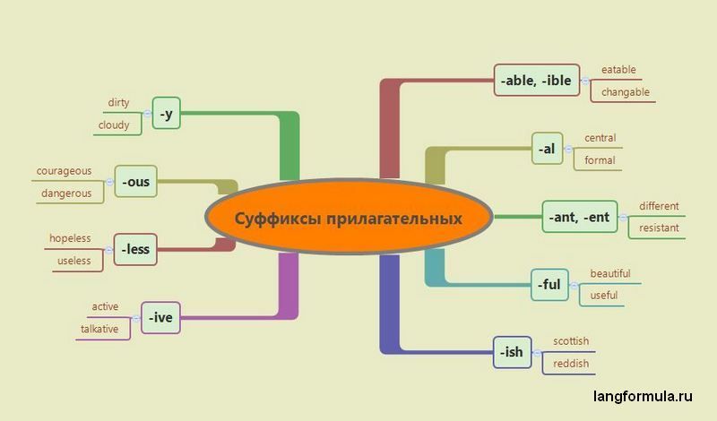

### Суффиксы прилагательных в английском языке

| **Суффикс**                 | **Значение**                                                                                                                                   | **Пример**                                                                                                                                                            |
|-----------------------------|------------------------------------------------------------------------------------------------------------------------------------------------|-----------------------------------------------------------------------------------------------------------------------------------------------------------------------|
| (verb/noun +) -able/ible    | возможность выполнения действия                                                                                                                |  to rely — reliable (полагаться — надежный)                                   |
| (verb +) -ent/ant           | качество                                                                                                                                       | to observe — observant (наблюдать — наблюдательный)                           |
| (noun +) -ary               | признак, свойство, качество                                                                                                                    | element — elementary (элемент — элементарный)  |
| (noun +) -ate               | | fortune — fortunate (удача — удачливый)|                                                                                                                                                                       |
| (verb +) -ing               | | to drive — driving (водить — движущий)  |                                                                                                                                                                       |
| -y                          | характеристика                                                                                                                                 | wealth — wealthy (богатство — богатый)                                                    |
| (noun/adj+noun/verb) -ed    | черта, качество                                                                                                                                | wood — wooded (дерево — деревянный)                           |
| (verb/noun/adj +) -ive/sive | признак, свойство, качество                                                                                                                    | to attract — attractive (привлекать — привлекательный)          |
| (noun/adj +) -ish           | принадлежность к чему-либо/кому-либо; в значении «приблизительно, около»; подразумевает раздражение, презрение; национальность                 | child — childish (ребенок — детский)          |
| (noun +) -ese               | национальность                                                                                                                                 | China — Chinese (Китай — китайский)                                     |
| (noun +) -ian               | относительные прилагательные от географических названий, личных имен или фамилий, названий отрядов и классов животных                          | Malaysia — Malaysian (Малайзия — малайзийский)      |
| (noun +) -al                | признак                                                                                                                                        | accident — accidental (случай — случайный)                                       |
| (noun +) -ical              | признак                                                                                                                                        | geology — geological (геология — геологический)       |
| (noun +) -ous               | признак, свойство, качество                                                                                                                    | fame — famous (слава — известный)                            |
| (noun +) -less              | отсутствие качеств                                                                                                                             | home — homeless (дом — бездомный)                                                           |
