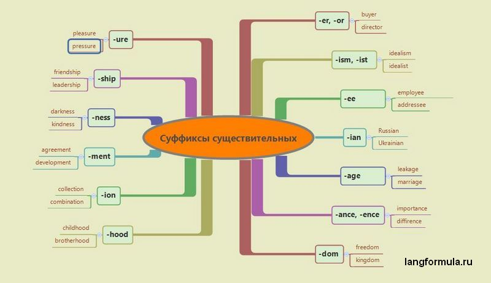
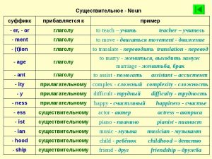

### Суффиксы существительных

| **Суффикс**                                   | **Значение**                                                                                                                                    | **Пример**                                                                                                                                                                                                     |
|-----------------------------------------------|-------------------------------------------------------------------------------------------------------------------------------------------------|----------------------------------------------------------------------------------------------------------------------------------------------------------------------------------------------------------------|
| (verb +) -er/or                               | исполнитель или инструмент, с помощью которого выполняется действие                                                                             | to research — researcher (исследовать — исследователь) to translate — translator (переводить — переводчик) to time — timer(отсчитывать время — таймер)                                                         |
| (verb +) -ent/ant                             | to serve — servant (служить — официант) to study — student (учиться — студент) to oxidize — oxidant(окислять — окислитель)                      | ada                                                                                                                                                                                                            |
| (verb +) -ing                                 | действие в процессе                                                                                                                             | to learn — learning (учить — учение) to travel — travelling (путешествовать — путешествие) to feel — feeling(чувствовать — чувства)                                                                            |
| (verb +) -age                                 | акт или факт действия                                                                                                                           | to assemble — assemblage (собирать — собрание) to break — breakage (ломать — поломка) to bag — baggage(складывать — багаж, перевозимое имущество)                                                              |
| (noun +) -age                                 | содержание чего-либо                                                                                                                            | percent — percentage (процент — процентное содержание) floor — floorage (пол — жилая площадь) freight — freightage(перевозка грузов — грузовместимость)                                                        |
| (adj +) -ness                                 | свойство, качество                                                                                                                              | white — whiteness (белый — белизна) clear — clearness (ясный — ясность) acid — acidness(кислотный — кислотность)                                                                                               |
| (adj +) -ity/ty, -ety/iety                    | состояние, условие, качество                                                                                                                    | normal — normality (нормальный — обычное состояние) active — activity (активный — активность) entire — entirety(целый — целостность, полнота)                                                                  |
| (verb +) -ment                                | процесс, результат                                                                                                                              | to measure — measurement (измерять — измерение, размер) to treat — treatment (лечить — лечение, уход) to manage — management(управлять, управление)                                                            |
| (verb/adj/noun +) -ance/ence                  | состояние, процесс, свойство                                                                                                                    | to enter — entrance (входить — вход) intelligent — intelligence (интеллигентный — интеллигентность) dependent — dependence(иждивенец/зависимый — зависимость)                                                  |
| (verb +) -ancy/ency                           | состояние, положение                                                                                                                            | to hesitate — hesitancy (сомневаться — сомнение) to vacate — vacancy (освобождать — пустое место, вакансия) to consist — consistency(состоять — состав, плотность)                                             |
| (adj/noun +) -cy/acy                          | состояние                                                                                                                                       | agent — agency (агент — агентство) accurate — accuracy (точный — точность) infant — infancy(младенец — младенчество)                                                                                           |
| (verb +) -ion/ation/ition, -sion/ssion, -cion | процесс, состояние, действие, абстр. понятие, свойство, качество                                                                                | to confuse — confusion (смущать — смущение) to permit — permission (разрешать — разрешение) to present — presentation(представлять — представление)                                                            |
| (noun/adj +) -dom                             | абстрактные и собирательные сущ.                                                                                                                | free — freedom (свободный — свобода) king — kingdom (король — королевство) bore — boredom(скучный — скука)                                                                                                     |
| (verb +) -ure/ture/sure                       | процесс, состояние, свойство, абстр. понятие, сфера деят-ти                                                                                     | to press — pressure (давить — давление) to mix — mixture (смешивать — смесь) to fail — failure(терпеть неудачу — неудача, провал)                                                                              |
| (noun +) -hood                                | общ. положение, качество, совокупность (людей)                                                                                                  | child — childhood (ребенок — детство) brother — brotherhood (брат — братство) neighbor — neighborhood(сосед — соседство, окружение)                                                                            |
| (noun/adj +) -ship                            | статус, состояние, свойство, занятие, отношение к чему-либо, абстр. понятие                                                                     | friend — friendship (друг — дружба) hard — hardship (тяжелый — невзгоды) owner — ownership(владелец — собственность)                                                                                           |
| (adj +) -th                                   | процесс, состояние                                                                                                                              | true — truth (правдивый — правда) deep — depth (глубокий — глубина) cool — coolth(холодный -прохлада, хладнокровие)                                                                                            |
| (verb +) -ee                                  | лицо/объект, на которое направлено действие                                                                                                     | to train — trainee (тренировать — стажер, практикант) to employ — employee (нанимать на работу — сотрудник) to award — awardee(награждать — призер)                                                            |
| (verb +) -al                                  | действие, состояние                                                                                                                             | to remove — removal (удалять — удаление) to arrive — arrival (прибывать — прибытие) to refuse — refusal(отказывать — отказ)                                                                                    |
| (verb/noun +) -ary/ery/ry                     | совокупность людей или вещей; черты характера (часто в неодобрительном плане); профессия, род занятий, социальное положение; место деятельности | ballad — balladry (баллада — стиль баллад, сложение баллад) snob — snobbery (сноб — снобизм) diet — dietary (питание, диета — книга о здоровой пище, режим питания) to bake — bakery(печь — пекарня, булочная) |
| (noun +) -ian                                 | национальность, звание, профессия                                                                                                               | Russia — Russian (Россия — русский) history — historian (история — историк) music — musician(музыка — музыкант)                                                                                                |
| (noun +) -ism                                 | учение, теория, качество, обобщ. явления                                                                                                        | Marx — Marxism (Маркс — марксизм) hero — heroism (герой — героизм) critic — criticism(критик — критика)                                                                                                        |
| (noun +) -ist                                 | профессия, принадлежность к партии, религии, философскому течению                                                                               | art — artist (искусство — артист, художник) piano — pianist (пианино — пианист) Marx — Marxist(Маркс — марксист)                                                                                               |
| (noun +) -ess                                 | принадлежность к женскому полу                                                                                                                  | steward — stewardess (стюард — стюардесса) waiter — waitress (официант — официантка) tiger — tigress(тигр — тигрица)                                                                                           |
| (noun +) -ette                                | уменьшительно-ласкательный суффикс; принадлежность к женскому полу; заменитель чего-либо                                                        | kitchen — kitchenette (кухня — кухонька) brunet — brunette (брюнет — брюнетка) leather — leatherette(кожа — искусственная кожа)                                                                                |
| (noun/adj +) -ite                             | последователь какого-либо течения, потомок; уроженец какой-либо области или места; название минералов                                           | Adam — Adamite (Адам — потомок Адама) Yemen — Yemenite (Йемен — йеменец) wolframic — wolframite(вольфрамокислый — вольфрам, вольфрамит)                                                                        |
| (noun +) -ese                                 | национальность                                                                                                                                  | China — Chinese (Китай — китаец) Japan — Japanese (Япония — японец) Vietnam — Vietnamese(Вьетнам — вьетнамец)                                                                                                  |
| (noun +) -ate                                 | образование солей; обозначение должности, общ. положения, группы людей, абстр. сущ.                                                             | nitric — nitrate (азотно-кислый — азотная кислота) episcope — episcopate (епископ — епископат) certify — certificate(сертифицировать — сертификат)                                                             |

### Суффиксы существительных в английском языке

Существительное обозначает какой–либо объект или предмет. Суффикс существительного английского языка отличается своим разнообразием и включает в себя следующие элементы: действующее лицо, качество или состояние, процесс или деятельность и т.д.

**NOTA BENE**: Если глагол заканчивается на –**ere**, но у существительного будет суффикс –**ence**: to interfere (вмешиваться) > interfer**ence** (помеха).

Если же на –**ate**, –**y**, –**ure** / –**ear**, то аффикс –**ance**: to devi**ate** (отклоняться) > devi**ance** (отклонение); to appl**y** (применять) > appli**ance** (приспособление); to cl**ear** (очищать) > clear**ance** (очистка).

Если же на –**ate**, –**y**, –**ure** / –**ear**, то аффикс –**ance**: to devi**ate** (отклоняться) > devi**ance** (отклонение); to appl**y** (применять) > appli**ance** (приспособление); to cl**ear** (очищать) > clear**ance** (очистка).

